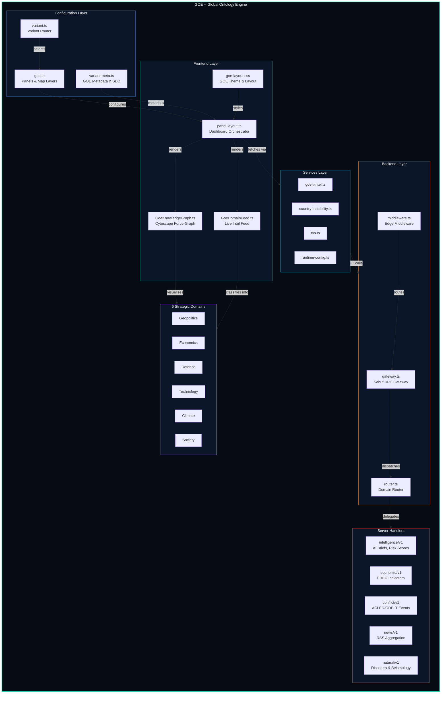
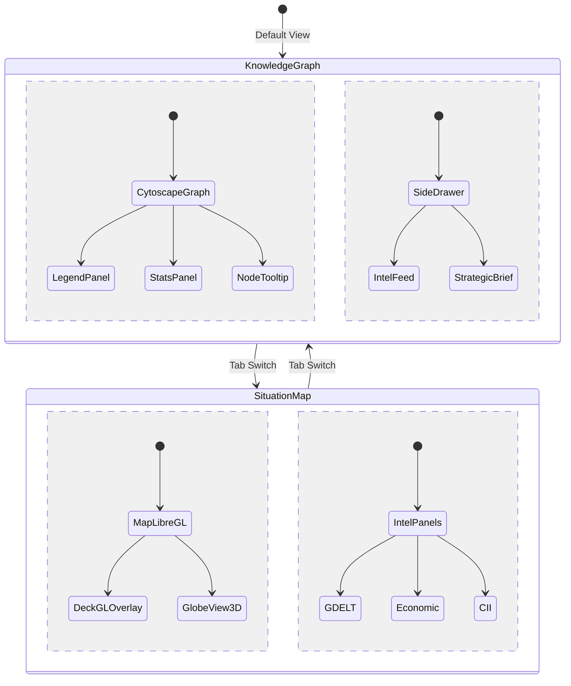

<div align="center">

# GOE — Global Ontology Engine

**India's Sovereign AI-Powered Strategic Intelligence Graph**

[]()
[]()
[]()

*A real-time strategic intelligence dashboard built for India — mapping national assets, defence capabilities, economic drivers, and diplomatic influence across a unified knowledge graph.*

</div>

---

## What is GOE?

**GOE (Global Ontology Engine)** is a sovereign AI intelligence platform that classifies, connects, and visualizes India's strategic landscape in real time. It organizes national intelligence into **6 strategic domains** and renders them as an interactive knowledge graph with live data feeds.

> **This is not a news aggregator.** GOE is a **strategic intelligence ontology** — a structured, interconnected knowledge system that maps how India's national interests, assets, and capabilities relate to each other.

### 6 Strategic Domains

| Domain | Focus | Color |
|--------|-------|-------|
| **Geopolitics** | Diplomacy, QUAD, BRICS+, UNSC reform, IMEC corridor | `#a855f7` |
| **Economics** | $5T economy drive, PLI schemes, Startup India, Make in India | `#f97316` |
| **Defence** | BrahMos, Tejas MK2, INS Vikrant, Agni-V ICBM, nuclear triad | `#ef4444` |
| **Technology** | Semiconductor fabs, Digital Public Infra, UPI, Aadhaar | `#3b82f6` |
| **Climate** | Solar Mission, Green Hydrogen, EV revolution, Ethanol blending | `#22c55e` |
| **Society** | NEP 2020, IIT system, Skill India, AIIMS network | `#eab308` |

---

## System Architecture



---

## Knowledge Graph Ontology

The GOE Knowledge Graph is a **force-directed graph** (powered by Cytoscape.js with fCose layout) that maps India's strategic assets hierarchically:

```mermaid
graph TD
    INDIA["BHARAT<br/><i>Core Node</i>"]

    INDIA --> DPI["DIGITAL PUBLIC INFRA"]
    INDIA --> DEF["SELF-RELIANT DEFENCE"]
    INDIA --> SEMI["SEMICONDUCTOR HUB"]
    INDIA --> ECON["$5T ECONOMY DRIVE"]
    INDIA --> SPACE["SPACE POWER"]
    INDIA --> DIPLO["GLOBAL LEADERSHIP"]
    INDIA --> GREEN["GREEN TRANSITION"]
    INDIA --> TALENT["HUMAN CAPITAL"]

    DPI --> UPI["UPI Global"]
    DPI --> ONDC["OCEN / ONDC"]
    DPI --> AADHAAR["Aadhaar 1.4B"]
    DPI --> DIGI["DigiLocker"]

    DEF --> BRAHMOS["BrahMos"]
    DEF --> VIKRANT["INS Vikrant"]
    DEF --> TEJAS["Tejas MK2"]
    DEF --> AGNI["Agni-V ICBM"]
    DEF --> ARIHANT["INS Arihant"]

    SEMI --> TATA["TATA-PSMC Fab"]
    SEMI --> MICRON["Micron Gujarat"]
    SEMI --> CG["CG Power Fab"]

    ECON --> PLI["PLI Schemes"]
    ECON --> GATI["Gati Shakti"]
    ECON --> STARTUP["Startup India"]
    ECON --> MAKE["Make in India"]

    SPACE --> CHANDRA["Chandrayaan 4"]
    SPACE --> GAGAN["Gaganyaan"]
    SPACE --> ADITYA["Aditya-L1"]
    SPACE --> INSPACE["IN-SPACe"]

    DIPLO --> QUAD["QUAD Alliance"]
    DIPLO --> IMEC["IMEC Corridor"]
    DIPLO --> G20["G20 Presidency"]
    DIPLO --> BRICS["BRICS+ Voice"]

    GREEN --> SOLAR["Solar Mission"]
    GREEN --> H2["Green Hydrogen"]
    GREEN --> EV["EV Revolution"]

    TALENT --> NEP["NEP 2020"]
    TALENT --> IIT["IIT System"]
    TALENT --> SKILL["Skill India"]

    %% Cross-domain synergies
    UPI -.->|formalization| ECON
    SEMI -.->|critical tech| DEF
    DPI -.->|fin inclusion| ECON
    STARTUP -.->|deep tech| INSPACE
    IIT -.->|chip design| SEMI

    style INDIA fill:#00d4aa,stroke:#fff,color:#050c14,stroke-width:3px
    style DPI fill:#3b82f6,stroke:#fff,color:#fff
    style DEF fill:#ef4444,stroke:#fff,color:#fff
    style SEMI fill:#3b82f6,stroke:#fff,color:#fff
    style ECON fill:#f97316,stroke:#fff,color:#fff
    style SPACE fill:#06b6d4,stroke:#fff,color:#fff
    style DIPLO fill:#a855f7,stroke:#fff,color:#fff
    style GREEN fill:#10b981,stroke:#fff,color:#fff
    style TALENT fill:#eab308,stroke:#fff,color:#050c14
```



### Graph Metrics

| Metric | Value |
|--------|-------|
| **Total Nodes** | 40+ |
| **Total Edges** | 55+ |
| **Strategic Domains** | 8 |
| **Cross-Domain Synergy Links** | 12 |
| **Node Tiers** | Core → Domain → Leaf |

---

## Dashboard Views

GOE provides two primary views accessible via a tab bar:



---

## Repository Structure

```
GOE/
├── README.md
├── server/
│   └── worldmonitor/
│       ├── intelligence/v1/
│       │   ├── search-gdelt-documents.ts    # GDELT event search & retrieval
│       │   ├── get-risk-scores.ts           # Country/region risk scoring engine
│       │   ├── get-country-intel-brief.ts   # AI-generated country intelligence briefs
│       │   ├── classify-event.ts            # Domain-based event classification
│       │   ├── deduct-situation.ts          # AI situation deduction engine
│       │   └── _shared.ts                   # Intelligence utilities
│       ├── economic/v1/
│       │   ├── get-fred-series.ts           # FRED economic indicator fetcher
│       │   ├── get-fred-series-batch.ts     # Batch FRED data retrieval
│       │   ├── get-macro-signals.ts         # Macro economic signal aggregator
│       │   └── _shared.ts                   # Economic utilities
│       ├── conflict/v1/
│       │   ├── list-acled-events.ts         # ACLED conflict event aggregation
│       │   ├── get-humanitarian-summary.ts  # Humanitarian crisis summaries
│       │   └── _shared.ts                   # Conflict utilities
│       ├── news/v1/
│       │   ├── list-feed-digest.ts          # RSS feed digest aggregation
│       │   ├── summarize-article.ts         # AI article summarization
│       │   ├── _classifier.ts              # News domain classifier
│       │   ├── _feeds.ts                   # Feed source definitions
│       │   └── _shared.ts                  # News utilities
│       ├── natural/v1/
│       │   └── list-natural-events.ts       # EONET natural disaster events
│       └── climate/v1/
│           └── list-climate-anomalies.ts    # Climate anomaly data
├── src/
│   ├── app/
│   │   └── panel-layout.ts                  # Dashboard orchestrator with GOE tab logic
│   ├── components/
│   │   ├── GoeDomainFeed.ts                 # 6-domain strategic intelligence feed
│   │   └── GoeKnowledgeGraph.ts             # Interactive knowledge graph (Cytoscape)
│   ├── config/
│   │   ├── variant.ts                       # Variant routing (GOE selection)
│   │   ├── variant-meta.ts                  # SEO metadata
│   │   └── variants/
│   │       └── goe.ts                       # GOE panels & map layer configuration
│   ├── services/
│   │   ├── gdelt-intel.ts                   # GDELT intelligence fetcher
│   │   ├── country-instability.ts           # Country instability index (CII)
│   │   ├── rss.ts                           # RSS feed parser
│   │   ├── runtime-config.ts               # Runtime configuration
│   │   ├── i18n.ts                          # Internationalization
│   │   ├── analytics.ts                     # Usage analytics
│   │   └── meta-tags.ts                     # SEO meta tag manager
│   └── styles/
│       └── goe-layout.css                   # GOE dark theme & layout
```

---

## Technical Stack

| Layer | Technology | Purpose |
|-------|-----------|---------|
| **Graph Engine** | Cytoscape.js + fCose | Force-directed knowledge graph layout |
| **Map Engine** | MapLibre GL + deck.gl | 2D/3D geospatial intelligence map |
| **Globe View** | globe.gl (Three.js) | 3D Earth visualization |
| **Language** | TypeScript | Type-safe source code |
| **Build** | Vite | Fast HMR development server |
| **Framework** | Preact | Lightweight UI rendering |
| **Data Viz** | D3.js | Charts, scales, and data transformations |

---

## Design Philosophy

1. **Sovereign by Design** — No external dependencies for core intelligence logic
2. **India-First Ontology** — Every node, edge, and domain is mapped to Indian strategic interests
3. **Real-Time Intelligence** — Live feeds classified into 6 strategic domains
4. **Cross-Domain Synergies** — Dashed edges show how India's strategic assets reinforce each other (e.g., IIT → Semiconductor, UPI → Economy)
5. **Dark Ops Aesthetic** — Military-grade dark UI with teal (#00d4aa) accent system

---

## Getting Started

This repository contains the **GOE variant source code** — the custom intelligence layer built on top of the world-monitor platform.

```bash
# Clone
git clone https://github.com/nahmahn/GOE.git

# The GOE variant is activated by setting the variant:
# localStorage.setItem('worldmonitor-variant', 'goe')
# or via environment variable:
# VITE_VARIANT=goe
```

---

## License

AGPL-3.0 — See [LICENSE](LICENSE) for details.

---

<div align="center">
<sub>Built for India's strategic intelligence future</sub>
</div>
